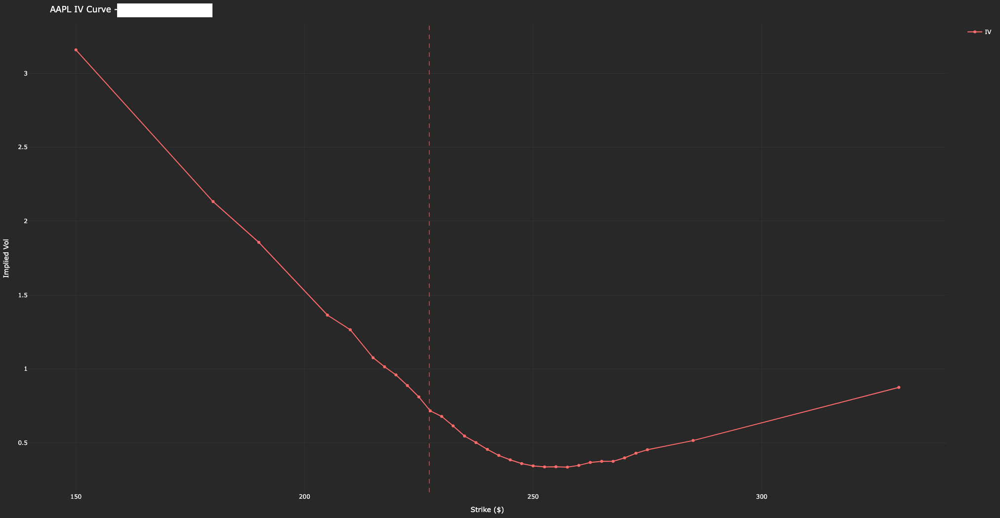

# aapl_iv_curve

- This project visualizes the implied volatility (IV) curve for **AAPL** (Apple Inc.) call options using real-time data from Yahoo Finance.
- It fetches historical stock prices and options data, filters by volume, and generates an interactive plot with Plotly.

---

## Files
- `aapl_iv_curve.py`: Main script for fetching data and generating the IV curve plot.
- `output.png`: Plot.

---

## Libraries Used
- `yfinance`
- `pandas`
- `plotly.graph_objects`

---

## Timeframe
- **Input**: Historical stock data ranges from **2024-06-15** to **2024-09-30**.
- **Output**: Visualizes the IV curve for the nearest expiration date of AAPL call options, filtered by volume (>10).

## Screenshots

